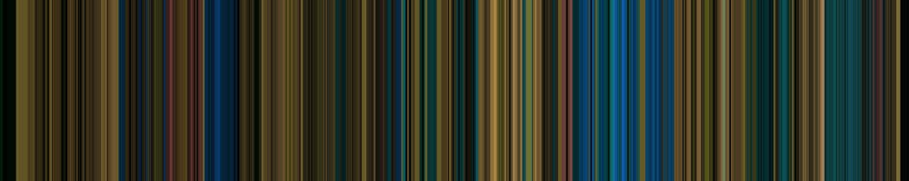

# VideoColorBench

Can a model recognize a famous video from just its colors?

Every frame of a video is shrunk to its average color and the colors are lined up into a barcode. The model sees the barcode and 10 titles and picks one. Guessing gets 10%.



200 questions: 100 films and 100 of the most viewed YouTube videos. Also on Hugging Face at [loganbolton/VideoColorBench](https://huggingface.co/datasets/loganbolton/VideoColorBench).

## Run a model

Needs [uv](https://docs.astral.sh/uv/) and an [OpenRouter](https://openrouter.ai/keys) key.

```bash
export OPENROUTER_API_KEY=sk-or-...
uv run run.py --model openai/gpt-6.1-sol
```

Useful flags: `--limit 5` for a quick trial, `--dataset films|youtube`, `--reasoning-effort medium`, `--harness opencode|claude|codex` to run the model inside a coding agent, `--check` to print the prompt and run nothing.

Results go to `results/<dataset>/<timestamp>-<name>/`. Pinned, repeatable experiments are YAML files in [experiments/](experiments/README.md).

## Results

One API call per question, image only.

| model | films | YouTube | overall |
|-------|-------|---------|---------|
| Opus 5.5 | 20% | 33% | 26.5% |
| GPT-6.1 Sol | 20% | 31% | 25.5% |
| GPT-6 Astra | 22% | 28% | 25.0% |
| Qwen3.5 397B | 16% | 23% | 19.5% |
| GLM-5.3 Flash | 16% | 20% | 18.0% |
| Qwen3.8 27B | 17% | 18% | 17.5% |

Inside a coding agent that can inspect the image, run code and search the web.

| model | films | YouTube | overall |
|-------|-------|---------|---------|
| GPT-6.1 Sol + Codex | 28% | 49% | 38.5% |
| Opus 5.5 + Claude Code | 17% | 27% | 22.0% |

## Rebuilding the data

```bash
uv run extract.py fetch --dataset youtube   # download each video, average it, delete it
uv run build_questions.py --dataset youtube # pick 9 plausible wrong answers per question
```

The video lists are `catalogs/films.json` and `catalogs/youtube.json`. Films come from archive.org and official distributor uploads on YouTube. Wrong answers are chosen to be hard: same genre, close in year, similar colorfulness.
